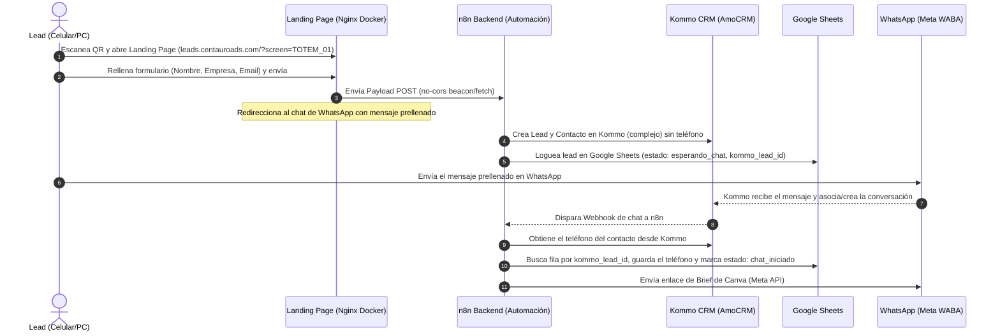

# Documentación de Arquitectura y Flujo del Proyecto

Este documento describe el flujo completo del sistema, los componentes de software involucrados y los algoritmos empleados en la solución de captura de leads e integración con WhatsApp/Kommo CRM para **Centauro DOOH**.

---

## 1. Mapa de Flujo de Datos y Usuario
El siguiente diagrama detalla cómo interactúan los componentes en el ciclo de vida de un lead:



---

## 2. Componentes de Software Involucrados

### A. Frontend: Landing Page Estática
*   **Código Fuente Local**: Directorio `public/`
    *   [index.html](file:///c:/Users/joaou/OneDrive/Documentos/Claude/Projects/FormWeb/public/index.html): Formulario de registro responsivo (estilo Glassmorphism).
    *   [privacidad.html](file:///c:/Users/joaou/OneDrive/Documentos/Claude/Projects/FormWeb/public/privacidad.html): Políticas de privacidad exigidas por Meta.
    *   [config.js](file:///c:/Users/joaou/OneDrive/Documentos/Claude/Projects/FormWeb/public/config.js): Define el webhook de recepción en n8n.
*   **Servidor Web**: Contenedor Docker con `nginx:alpine` (`project_leads-dooh`) montado sobre `/var/www/leads`.
*   **Proxy de Entrada**: Traefik de Easypanel expone el servicio en `https://leads.centauroads.com` con SSL automático de Let's Encrypt.

### B. Backend: n8n Workflow Engine
*   **Instancia**: `https://n8n.centauroads.com` corriendo en contenedor Docker.
*   **Flujos Activos**:
    1.  **Chatbot de Respuesta (`wf_chatbot.json` / ID: `U02Z6lSLDwTr6Ber`)**: Escucha los mensajes entrantes de WhatsApp y responde de forma automatizada.
    2.  **Captura de Leads (`wf_leads.json`)**: Procesa los envíos de la Landing Page, actualiza campos personalizados en Kommo CRM y escribe en Google Sheets.
    3.  **Utilidades de Reactivación (`wf_utility.json`)**: Envía plantillas a contactos inactivos.
*   **Persistencia**: Base de datos SQLite `/root/.n8n/database.sqlite` (mapeada en volúmenes Docker del droplet).

### C. Integraciones de API Externas
*   **Meta WhatsApp Cloud API**: Canal oficial de comunicación. Envía plantillas aprobadas y mensajes de texto plano.
*   **Kommo CRM**: Almacena los leads en pipelines, gestiona contactos y campos personalizados (`Nombre de Empresa`, etc.).
*   **Google Sheets API**: Usado mediante cuenta de servicio (`n8n-bot-leads@...`) para guardar registros como backup.

---

## 3. Algoritmos y Código Empleado

### Algoritmo 1: Captura de Datos en Landing Page y Redirección
Extrae variables de la URL del lead, envía los datos del formulario asíncronamente a n8n, redirige al usuario de vuelta a su chat de WhatsApp y ejecuta el auto-cierre de la pestaña.

```javascript
// Localizado en: public/index.html
document.getElementById("leadForm").addEventListener("submit", async (e) => {
  e.preventDefault();
  
  const btn = document.getElementById("btn");
  const btnText = document.getElementById("btnText");
  const spinner = document.getElementById("spinner");
  
  // UI Loading State
  btn.disabled = true;
  btnText.textContent = "Abriendo WhatsApp...";
  spinner.style.display = "inline-block";

  const data = {
    nombre: document.getElementById("nombre").value.trim(),
    empresa: document.getElementById("empresa").value.trim(),
    email: document.getElementById("email").value.trim(),
    tipo_dispositivo: document.getElementById("tipo_dispositivo").value,
    screen_id: screenId,
    consentimiento: document.getElementById("consent").checked,
    timestamp: new Date().toISOString(),
    user_agent: navigator.userAgent
  };

  // Envío del Payload asíncrono a n8n sin retrasar la redirección.
  // Usamos URLSearchParams para evitar bloqueos CORS preflight (OPTIONS)
  // y garantizar que n8n parsee automáticamente la petición.
  const params = new URLSearchParams();
  params.append("nombre", data.nombre);
  params.append("empresa", data.empresa);
  params.append("email", data.email);
  params.append("tipo_dispositivo", data.tipo_dispositivo);
  params.append("screen_id", data.screen_id);
  params.append("consentimiento", data.consentimiento);
  params.append("timestamp", data.timestamp);
  params.append("user_agent", data.user_agent);

  try {
    navigator.sendBeacon(N8N_WEBHOOK, params);
  } catch (_) {
    // Fallback robusto con fetch persistente (keepalive)
    fetch(N8N_WEBHOOK, {
      method: "POST",
      body: params,
      keepalive: true,
      mode: "no-cors"
    }).catch(() => {});
  }

  // Ocultar formulario y mostrar pantalla de éxito limpia
  document.getElementById("leadForm").style.display = "none";
  document.querySelector("h1").style.display = "none";
  document.querySelector("p.sub").style.display = "none";
  
  const successDiv = document.createElement("div");
  successDiv.className = "success-state";
  successDiv.style.display = "block";
  successDiv.innerHTML = `
    <h2>¡Redireccionando a WhatsApp!</h2>
    <p>Hemos procesado tu solicitud comercial.<br>Por favor, envía el mensaje prellenado en el chat que se abrirá automáticamente en tu WhatsApp.</p>
    <button class="close-btn" onclick="window.close()">Cerrar pestaña</button>
  `;
  document.querySelector(".card").appendChild(successDiv);

  // Mensaje prellenado para abrir en WhatsApp
  const friendlyDevice = data.tipo_dispositivo === "Totem" ? "Mobiliario Inteligente (TOTEM)" : "Pantalla LED Outdoor";
  const msg = `Hola Centauro Ads, soy ${data.nombre} de la empresa ${data.empresa}, correo: ${data.email}. Vi su ${friendlyDevice} (${screenId}) y quiero recibir el brief de pantallas LED y TOTEMs.`;
  
  const whatsappUrl = `https://wa.me/${WHATSAPP}?text=${encodeURIComponent(msg)}`;
  
  // Timeout para permitir que sendBeacon envíe los datos
  setTimeout(() => {
    window.location.href = whatsappUrl;
    
    // Cerrar la pestaña automáticamente
    setTimeout(() => {
      window.close();
    }, 1000);
  }, 300);
});
```

### Algoritmo 2: Despliegue Automatizado a Producción (Droplet)
Script local que sube los archivos modificados de la Landing Page por SFTP al Droplet y reinicia el servicio Nginx Docker para asegurar que los cambios se reflejen.

```javascript
// Localizado en: scratch/deploy-leads.js
const { Client } = require('ssh2');
const path = require('path');

const conn = new Client();
conn.on('ready', () => {
  console.log("Conectado vía SSH.");
  
  // 1. Crear directorio remoto
  conn.exec("mkdir -p /var/www/leads", (err, stream) => {
    stream.on('close', () => {
      // 2. Establecer sesión SFTP para subir index.html, config.js, privacidad.html
      conn.sftp((err, sftp) => {
        sftp.fastPut('public/index.html', '/var/www/leads/index.html', (err) => {
          // 3. Crear/Reiniciar el contenedor Nginx en la red de Easypanel
          const cmd = "docker service rm project_leads-dooh && sleep 2 && " +
                      "docker service create --name project_leads-dooh --network easypanel " +
                      "--mount type=bind,source=/var/www/leads,target=/usr/share/nginx/html nginx:alpine";
          conn.exec(cmd, (err2, stream2) => {
            stream2.on('close', () => {
              console.log("Despliegue completado.");
              conn.end();
            });
          });
        });
      });
    });
  });
}).connect({
  host: '167.172.217.151',
  port: 22,
  username: 'root',
  password: 'MERcenta2026!.ds'
});
```

### Algoritmo 3: Integración de la API oficial de Meta en n8n
Payload HTTP POST enviado al endpoint de Meta para disparar la plantilla de seguimiento:

*   **URL**: `https://graph.facebook.com/v21.0/{{$env.META_PHONE_NUMBER_ID}}/messages`
*   **Headers**:
    *   `Authorization`: `Bearer {{$env.META_ACCESS_TOKEN}}`
    *   `Content-Type`: `application/json`
*   **Payload JSON**:
```json
{
  "messaging_product": "whatsapp",
  "to": "{{$json.telefono}}",
  "type": "template",
  "template": {
    "name": "seguimiento_brief_dooh",
    "language": {
      "code": "es"
    },
    "components": [
      {
        "type": "body",
        "parameters": [
          {
            "type": "text",
            "text": "{{$json.nombre_cliente}}"
          },
          {
            "type": "text",
            "text": "{{$json.nombre_empresa}}"
          }
        ]
      }
    ]
  }
}
```

---

## 4. Instrucciones de Reactivación del Proyecto para el Asesor

1.  **Actualizar Credenciales de Meta**:
    *   Los tokens guardados expiraron debido a cambio de contraseñas de Facebook (Error 190/460).
    *   Se debe ir al Administrador Comercial de Facebook de Centauro, crear un usuario del sistema (System User), generar un Token de Acceso Permanente con permisos `whatsapp_business_messaging`, y configurar el **Phone Number ID** de la consola de desarrolladores.
2.  **Configurar Variables de Entorno**:
    *   Configurar `META_ACCESS_TOKEN` y `META_PHONE_NUMBER_ID` en el panel de n8n en Easypanel (`https://panel.centauroads.com`).
3.  **Probar Flujo Completo**:
    *   Enviar un mensaje por WhatsApp al número `+58 422 1003559`, verificar que n8n reciba el mensaje, cree el contacto en Kommo, envíe el enlace de la landing page con el `contactId` dinámico, rellenar el formulario de la landing, y validar que se actualice la ficha del CRM y se intente cerrar la ventana de redirección.
